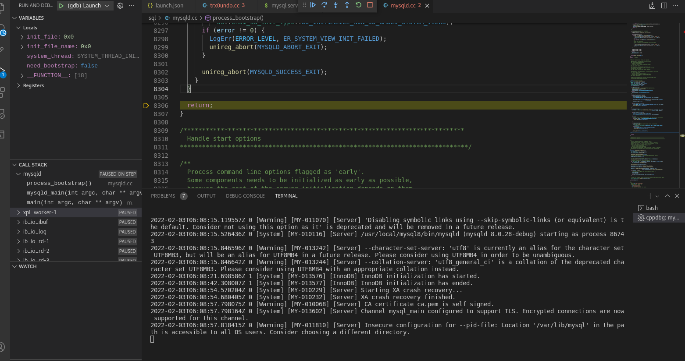
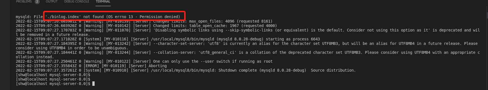

## MYSQL debug

    debug是阅读学习源码的有效手段。那么MySQL该如何debug呢？
    
    编辑器：VS Code 
    虚拟机:VMware workstation 16 player
    操作系统：CentOS 7 x86_64
    mysql: 8.0+

#### Debug
    
    两种思路：
    第一种通过vscode实现虚拟机上MySQL数据库的远程Debug。
    第二种直接在虚拟机上安装VS code，本地Debug
    
    采取第二种方式
    Vscode安装后启动命令：/usr/share/code/code --user-data-dir

    MySQL源码下载
    git 加速镜像域名：https://github.com.cnpmjs.org 好用!!

    cmake .. -DCMAKE_INSTALL_PREFIX=/home/shw/mysql \
    -DDEFAULT_CHARSET=utf8 \
    -DDEFAULT_COLLATION=utf8_general_ci \
    -DENABLED_LOCAL_INFILE=ON \
    -DWITH_INNODB_MEMCACHED=ON \
    -DWITH_INNOBASE_STORAGE_ENGINE=1 \
    -DDOWNLOAD_BOOST=1 \
    -DWITH_BOOST=/work/mysql-server/mysql-server/boost/boost_1_72_0
    -DCMAKE_BUILD_TYPE=Debug    

    
     mkdir -p build
     cd build

    cmake .. \
    -DCMAKE_INSTALL_PREFIX=/usr/local/mysql \
    -DMYSQL_DATADIR=/data/mysql \
    -DSYSCONFDIR=/etc \
    -DMYSQL_UNIX_ADDR=/var/lib/mysql/mysqld.sock \
    -DEXTRA_CHARSETS=all \
    -DDEFAULT_CHARSET=utf8 \
    -DDEFAULT_COLLATION=utf8_general_ci \
    -DWITH_MYISAM_STORAGE_ENGINE=1 \
    -DWITH_INNOBASE_STORAGE_ENGINE=1 \
    -DWITH_PARTITION_STORAGE_ENGINE=1 \
    -DENABLED_LOCAL_INFILE=1 \
    -DENABLED_PROFILING=1 \
    -DMYSQL_TCP_PORT=3306 \
    -DWITH_DEBUG=0 \
    -DDOWNLOAD_BOOST=1 \
    -DWITH_BOOST=/usr/local/boost_1_59_0   // 需要手动下载
    -DCMAKE_BUILD_TYPE=Debug    
    
    -DCMAKE_C_COMPILER=/usr/bin/gcc  // 配置指定版本的gcc g++
    -DCMAKE_CXX_COMPILER=/usr/bin/g++

    上述参数名称解释

    DCMAKE_INSTALL_PREFIX=/usr/local/mysql      :安装路径
    DMYSQL_DATADIR=/data/mysql                  :数据文件存放位置
    DSYSCONFDIR=/etc                            :my.cnf路径
    DMYSQL_UNIX_ADDR=/var/lib/mysql/mysqld.sock :连接数据库socket路径
    DEXTRA_CHARSETS=all                         :安装所有的字符集
    DDEFAULT_CHARSET=utf8                       :默认字符
    DDEFAULT_COLLATION=utf8_general_ci          :排序集
    DWITH_MYISAM_STORAGE_ENGINE=1               :支持MyIASM引擎
    DWITH_INNOBASE_STORAGE_ENGINE=1             :支持InnoDB引擎
    DWITH_PARTITION_STORAGE_ENGINE=1            :安装支持数据库分区
    DENABLED_LOCAL_INFILE=1                     :允许从本地导入数据
    DENABLED_PROFILING=1                        :
    DMYSQL_TCP_PORT=3306                        :端口
    DWITH_DEBUG=0                               :
    DDOWNLOAD_BOOST=1                           :允许下载
    DWITH_BOOST=/usr/local/boost_1_59_0         :本地boost路径

    yum install boost boost-devel boost-doc
     
    多线程make: make -j 4
    将编译后的文件安装: make install
    
    ssl 问题 ：yum install openssl-devel
    ...
    遇水搭桥，遇山开路！
    ...

    每次cmake之前记得删除缓存，重新来过！

    du -ah --max-depth=1
    
    首先切入root权限:su 

    ./mysqld --initialize --console

    MySQL启动：/usr/local/mysql/support-files/mysql.server start --user=root

    mysql服务启动后，登录MySQL：mysql -u root

    MySQL停止：/usr/local/mysql/support-files/mysql.server stop
    

###### mysql.sock
    
   [关于mysql.sock](https://segmentfault.com/a/1190000016098820)

###### my.cnf
   
    MySQL启动时配置文件路径:/etc/my.cnf

###### vscode

    启动路径：/usr/share/code/code  --user-data-dir

#### 遇到bug

######@1 vscode debug出错

    上述是权限问题，切换到su root即可。

## 参考

[cmake3安装](https://www.cnblogs.com/fps2tao/p/9341795.html)  安装3.8.1 [下载链接](https://cmake.org/files/v3.8/cmake-3.8.1.tar.gz)   
[源码安装cmake后正确卸载姿势](https://www.cxyzjd.com/article/linlin707/101016579)  
[GCC升级1](https://blog.csdn.net/weixin_39658118/article/details/110223894)  
[GCC升级2](https://www.cnblogs.com/NanZhiHan/p/11010130.html)  gcc 10.2 [下载链接](http://ftp.tsukuba.wide.ad.jp/software/gcc/releases/gcc-10.2.0/)  
[yum-erros](https://wiki.centos.org/yum-errors)  
[文件系统如何挂载到根目录](https://blog.51cto.com/zhangxueliang/2967817)  
[Centos根目录下各个目录介绍](https://www.cnblogs.com/CMX_Shmily/p/12033207.html)  
[GCC镜像下载加速](https://mirrors.tuna.tsinghua.edu.cn/gnu/gcc/gcc-8.3.0/)  
[libstdc++.so.6.0 not found](https://itbilu.com/linux/management/NymXRUieg.html)
[mysql编译安装](https://developer.aliyun.com/article/727403)  
[vscode远程debug配置](https://code.visualstudio.com/docs/remote/ssh)  
[/usr/lib64/libstdc++.so.6: version `GLIBCXX_3.4.21' not found](https://www.jianshu.com/p/5eee15182ff6)  
[log-error set to '/var/log/mariadb/mariadb.log', however file don't exists.](https://blog.csdn.net/BertonYip/article/details/80829524)  
[Failed to find valid data directory.](https://stackoverflow.com/questions/52719378/failed-to-find-valid-data-directory-mysql-generic-binary-installion)  
[ERROR 1045 (28000): Access denied for user 'root'@'localhost' (using password: NO)](https://www.jb51.net/article/215881.htm)

    

    