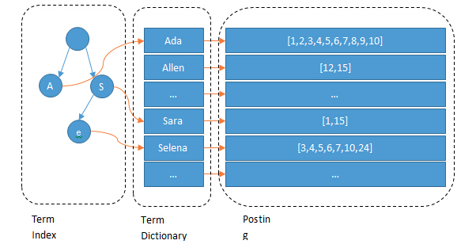

## 分词
   
   ES中分词使用分为两种场景，第一种场景是数据存储到ES中需要先分词后存储；第二种场景是查询时对内容进行分词。
   分词器由字符过滤器（character filter 过滤特殊字符）、分词部分、token过滤(token filter)三个部分组成。
   ES中常用的分词器有standard、whiteSpace等。其中常用中文分词器有IK中文分词器。
   
#### 关于jieba分词原理

   
   

## 倒排索引

    ES底层使用倒排索引实现数据的组织和存储，即Term index -> Term Dictionary -> Posting list
    
    ES会为每个字段建立倒排索引，这也是其查询速度高的原因。比如文档中的content字段建立倒排索引，首选对内容进行分词，即一个一个term，然后计算出每个term的posting list，即该词在
    哪些文档中出现。
    
    举例子如下存储结构
    
    docid            title              content
     1               Java            Java多线程原理
     2               Python          Python数据分析原理
     3               C++             虚函数原理
     
     ES在对content字段建立索引时，先分词为:Java 多线程 原理  Python 数据 分析 原理  虚函数 原理
     Java -> [1]
     多线程 -> [1]
     原理 -> [1,2,3]
     Python -> [2]
     数据 -> [2]
     分析 -> [2]
     虚函数 -> [3]
     
     以上就是倒排索引列表。可以看到从Term到posting list建立了关系，但有个问题，当用户输入搜索词“原理”时，难道需要一个一个Term遍历吗，非也。
     为了提升查询速度，ES会对Term排序，这样可以二分搜索，O(logN)时间复杂度定位到对应的posting list，即ES会建立Term Dictionary，key为Term，Value为Posting list。
     
     再深入考虑一下，如果content内容非常多，分的Term有几万个，甚至几十万，这样需要在一个很大的字典上搜索，因此在搜索时会频繁的访问磁盘，并且如果同时把Term Dictionary缓存到内存中，会撑爆内存，所以为了进一步提升速度，会把Term Dictionary进一步抽象，即Term Index。Term Index类似一本字典大的章节列表，比如:
     A 开头的Term ................XXX页
     B 开头的Term ................XXX页
     E 开头的Term ................XXX页
     
     如果所有的Term都是英文字符，那么Term index就是26个英文字符表构成。但实际可能以s开头的没有，以q开头的非常多。即很多单词前缀字符相同，又想到了前缀树结构。
     所以Term Index是对Term Dictionary做的进一步抽象，其常驻内存。搜索时先在Term Index上找到Term大致位于哪个磁盘页，然后到对应磁盘页二分搜索对应的Term Dictionary，最终拿到
     Posting list，取到搜索的文档的内容。
     
  

## DSL基础语法
     
     ElasticSearch version:6.7.0

#### 普通查询语法积累

        查询语法格式

        query 
                Term
                Terms
                match_all // 在所有字段中搜索
                Match   // 在单个字段中搜索
                multi_match // 在多个指定的字段中搜索

                GET /ad_hour_data_realtime_v4/doc/_search
                {
                  "query": {
                    "bool": {
                      "filter": [
                            {
                                "term": {
                                            "agent": "qj_2022"
                                  }
                            },
                           {
                                "range": {
                                      "date": {
                                              "gte": "2022-11-10T04",
                                                "lte": "2022-11-11T04"
                                       }
                                }
                           }
                      ]
                    }
                  }
                }

                select * from ad_hour_data_realtime_v4 where agent = ‘qj_2022’ and (date between "2022-11-10T04" and "2022-11-11T04”)

                GET /ad_hour_data_realtime_v4/doc/_search
                {
                  "query": {
                    "bool": {
                        "must": [
                            {"term": {"account": "25955794"}},
                            {"term": {"channel": "GDTM"}},
                            {"range": {"date": {"gte": "2022-11-10T04","lte": "2022-11-15T04"}}}
                       ]
                    }
                  }
                }

                Select * from ad_hour_data_realtime_v4 where account = ‘25955794’ and channel = ‘GDTM’ and (date between "2022-11-10T04" and "2022-11-11T04”)

                GET /ad_hour_data_realtime_v4/doc/_search
                {
                  "query": {
                    "term":{
                      "adName.keyword":"1116-亿玛-29元-dyh-B1通投-大图-dt48CNN-通-下单-875-商品"
                    }
                  }
                }

                ES查询时不做分词

                GET /ad_hour_data_realtime_v4/doc/_search
                {
                  "query": {
                    "terms":{
                      "adName.keyword":["1116-亿玛-29元-dyh-B1通投-大图-dt48CNN-通-下单-875-商品",""]
                    }
                  }
                }

                Select * ad_hour_data_realtime_v4 where adName in (‘1116-亿玛-29元-dyh-B1通投-大图-dt48CNN-通-下单-875-商品’)

                GET /ad_hour_data_realtime_v4/doc/_search
                {
                  "query": {
                    "match":{
                      "channel":"GDT"
                    }
                  }  
                }

                // 文档字段channel包含’GDT’的都会被搜索出来

                GET /ad_hour_data_realtime_v4/doc/_search
                {

                    "from":0,
                    "size":1

                }

                match match_phrase mutil_match term 的区别

                {
                “Query”:{
                      “match”:{
                            “content”:”我的宝马多少马力”
                       }
                  }
                }

                // 查询会将内容分词为:宝马 多少 马力，凡是content字段包含任意一个或多个的都会被查出来。

                {
                “Query”:{
                      “match_phrase”:{
                            “content”:”我的宝马多少马力”
                       }
                  }
                }

                // 使用match_phrase可以实现完全匹配，匹配严格，content字段必须同时包含:宝马 多少 马力

                {
                “Query”:{
                    “mutil_match”:{
                        “Query”:”我得宝马多少马力”,
                         Fields:{“title”,”content”}
                  }
                }
                }
                // 在多个字段中进行匹配

                Term是进行完全匹配，不进行分词分析，文档必须包含整个搜索的词汇。
                
                
#### 聚合查询语法积累

                范围查询 然后按照日期排序
                GET /ad_hour_data_realtime_v4/doc/_search
                {

                   "query":{
                     "range": {
                      "date":{
                        "gte":"2022-11-15T12",
                        "lte":"2022-11-16T12"
                      }
                    }
                    },
                    "sort":{
                      "date":{
                        "order":"asc"
                      }
                    },
                    "from":0,
                    "size":1
                }

                Select * from ad_hour_data_realtime_v4 where date between ‘2022-11-15T12’ and ‘2022-11-16T12’ date order by asc; 

                GET /ad_hour_data_realtime_v4/doc/_search
                {
                  "aggs":{
                    "clickCountShow":{
                      "min":{"field":"clickCount"}
                    }
                  },
                  "size":0
                }

                Select min(clickCount) as clickCountShow from ad_hour_data_realtime_v4

                GET /ad_hour_data_realtime_v4/doc/_search
                { 
                  "query":{
                    "term":{
                      "account":"25955794"
                    }
                  },
                  "aggs":{
                    "paidOrderCount":{
                      "max":{"field":"paidOrderCount"}
                    }
                  },
                  "size":0 // 只展示聚合结果，否则所有内容都展示
                }

                Select min(paidOrderCount) as paidOrderCount from ad_hour_data_realtime_v4 where account = ‘25955794’
                

#### 操作索引语法积累

                查看某个指定索引的文档内容

                GET /ad_hour_data_realtime_v4/doc/eafe78530d1068ccd95372d3a04c4c78

                Select * from ad_hour_data_realtime_v4 where id = ‘eafe78530d1068ccd95372d3a04c4c78’

                修改某个索引下指定字段值

                POST /ad_hour_data_realtime_v4/doc/1534f456384b2ce0c85cf99bf165443c/_update 
                {
                  "doc":{
                    "adId":"1752003083474999"
                  }
                }

                Update ad_hour_data_realtime_v4 set adId = ‘1752003083474999’ where id = ‘1534f456384b2ce0c85cf99bf165443c’

                往某个索引下添加文档

                POST /ad_hour_data_realtime_v4/_doc
                {
                  "accountName":"手动添加的一个测试账号"
                }

                根据返回值查询添加的结果

                GET /ad_hour_data_realtime_v4/doc/sVZ-IIUBLQ4krjD6aTfc

                修改为字段赋值
                POST /ad_hour_data_realtime_v4/doc/sVZ-IIUBLQ4krjD6aTfc/_update
                {
                  "doc":{
                     "account":"123456"
                  }
                }

#### ElasticSearch 文档结构操作

                新建一个索引结构，用来组织存储文档

                版本7.0以下使用如下方式

                PUT /ad_test
                {
                  "settings": {
                    "number_of_shards": 2,
                    "number_of_replicas": 1
                  },
                  "mappings": {
                    "ad_info": { // 7.0以上删掉这个
                      "properties": {
                        "adname": {
                          "type": "text",
                          "analyzer": "ik_smart"
                        }
                      }
                    }
                  }
                }

                新添加一个字段，并指定默认值

                添加字段
                PUT /ad_test/_doc/_mapping
                {
                    "properties": {
                        "adType": {
                            "type": "integer"
                        }
                    } 
                }
                然后指定默认值
                POST /ad_test/_update_by_query
                {
                  "script":{
                    "lang":"painless",
                    "source":"if (ctx._source.adType == null) {ctx._source.adType = 1}"
                  }
                }

                相当于使用painless脚本语言把ES中的老数据刷了一遍。

## 参考资料

[1. 官方文档](https://www.elastic.co/cn/webinars/getting-started-elasticsearch)
[2. ES实战]()
