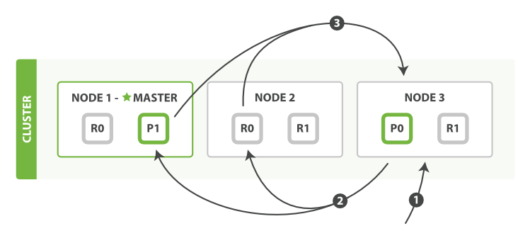

## Elasticsearch的读写流程

### 读流程

    ElasticSearch查询分为两个阶段，先是查询，然后取回，即两阶段查询,query-then-fetch。
    
    
    
#### 查询阶段

    1、客户端发送查询请求给某个节点，收到请求的节点作为协调者节点coordinator，协调节点在本地创建一个优先级队列。
    2、然后协调者节点把请求分发给其它分片的主节点或副本节点，收到分发请求的节点会在本地创建优先级队列，并执行查询请求，把结果放到优先级队列中。
    3、每个分片返回各自文档ID集合和对应的排序值给协调节点，协调节点收到后再做一次全局排序，然后放到自己的优先级队列中。

#### 取回阶段

    1、协调者节点辨别哪些文档需要返回，然后向分片节点发送多个GET请求。
    2、每个分片节点加载文档详细内容，然后把内容返回给协调者节点。
    3、一旦所有文档被取回了，协调者将结果返回给客户端。
    
    ElasticSearch分页查询时，会有深度分页的问题，比如查询10000,100,需要创建一个100100大小的优先级队列。也就是说分页是在协调者节点上进行的。
    所以经常出现CPU和内存被打满的问题。

### 写入流程
