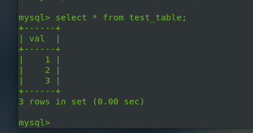

## SQL解析原理

    一条SQL语句从执行到输出结果，都发了什么？

#### 实验准备

    1、创建一张数据表
     use test;
     create table test_table (val,INT) ENGINE InnoDB;
    2、往数据表中插入数据
     insert into test_table value (1);
    3、执行最简单的SQL查询语句

#### start debug

    目标语句:select * from test_table;

## 参考资料
1、[mysql internal code](https://dev.mysql.com/doc/internals/en/guided-tour.html)  

2、[understanding mysql internal](https://learning.oreilly.com/library/view/understanding-mysql-internals/0596009577/ch09.html#orm9780596009571-CHP-9-SECT-1)  

3、[courseMain](https://study.163.com/course/courseMain.htm?courseId=1002830012&_trace_c_p_k2_=fd193e38abbc43098f37619f4a858815)

4、[mysql代码文档](https://dev.mysql.com/doc/dev/mysql-server/latest/classReadView.html)

5、[innodb undo log](https://dev.mysql.com/doc/refman/5.7/en/innodb-undo-logs.html)