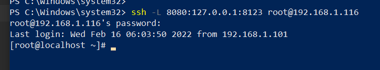
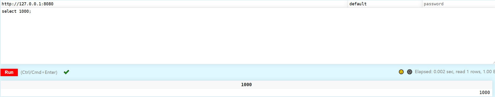

## Shell脚本语言基础使用

#### ssh本地端口映射远程服务器端口

  环境:VMware虚拟机
  ssh -L 8080:127.0.0.1:8123 root@192.168.1.116
  8080：本地服务器端口
  127.0.0.1:回环地址 或者localhost
  root@192.168.1.116:远程服务器地址和用户名
  
  比如，在VMware虚拟机上安装clickhouse服务，将http端口8123映射到本地访问
  执行上述命令即可：  

  映射完成后，本地机器访问:http://127.0.0.1:8080/play
  
