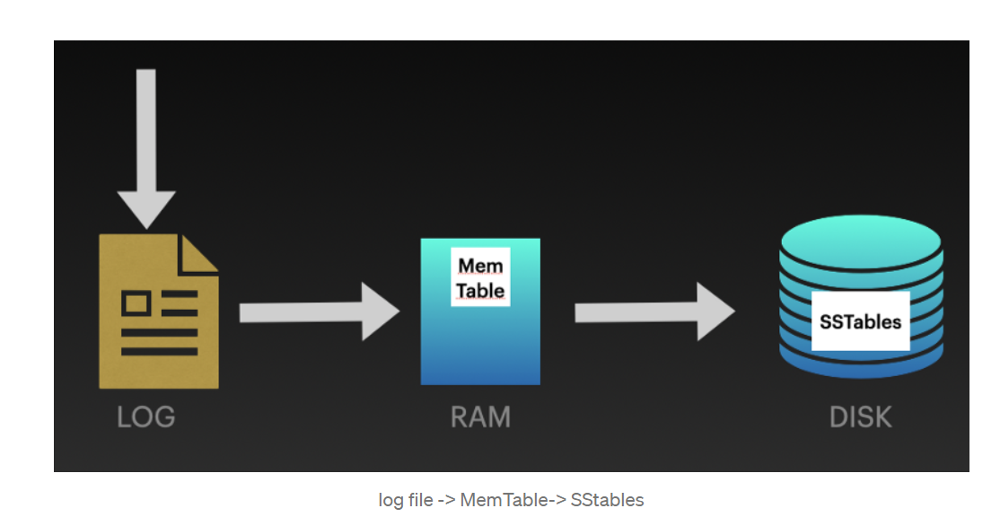
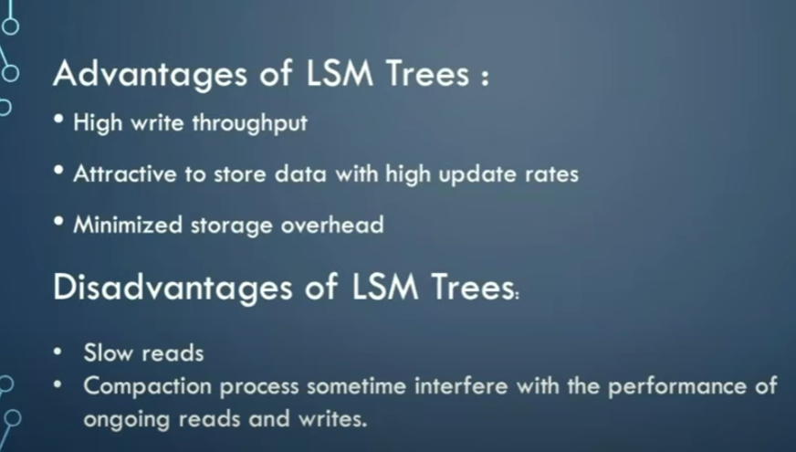

## 索引

     clickhouse底层使用MergeTree索引实现数据的组织与存储。
     索引是用来提升数据搜索速度的，那么为什么clickhouse采取mergeTree实现索引呢，为啥不使用B+树存储呢？

#### LSM_Tree
     
     在看MergeTree索引之前，先来看看什么是LSM_Tree，
     LSM_Tree适用写多读少的场景，比如对索引以及关联数据频繁的插入操作，它的效率会非常快。考虑一种场景，业务日志
     需要频繁的插入到数据库，然后定时查询统计日志分布信息等，可以考虑使用clickhouse.
    
     关于LSM_Tree树具体执行流程，参考如下英文：
     We append the instructions on the log file and also write the same on the in-memory data structure known as Memtables. 
     When Memtables grow beyond a certain threshold, MemTables are flushed into SStables. 
     SStables are stored on disk and are slower as compared to the Memtables. 
     To speed up the process of searching the data, SStables contain an on-memory data structure known as Bloom filters.
     

    
     如上图所示，对于插入操作，LSM_Tree会先将信息追加写到日志文件，用来容灾，为啥要追加，因为磁盘顺序写速度非常快，甚至超过内存写操作。
     所以不会耽误太多时间。当日志追加完成后，将数据按照指定数据结构写入到Page Cache中，即直接写入内存。此时整个操作已经完成，所以速度也是
     非常快的。然后随着MamTable逐渐变大，会逐步写入磁盘中。嗯，和kafka消息落盘很像，原理类似。
     当SSTable大小达到指定阈值，会在后台进行合并操作，即将重复的数据压缩。

#### 磁盘顺序写和随机写时间对比

#### MergeTree

## 参考

[1、官方论文](http://citeseerx.ist.psu.edu/viewdoc/download?doi=10.1.1.44.2782&rep=rep1&type=pdf)  
[2、steped-merge](https://arxiv.org/pdf/2004.01833.pdf)  
[3、LSM-TREE blog](https://javascript.plainenglish.io/understanding-how-databases-store-our-data-introduction-to-lsm-trees-ec1c46096570)  
[4、入门](https://www.youtube.com/watch?v=oUNjDHYFES8)