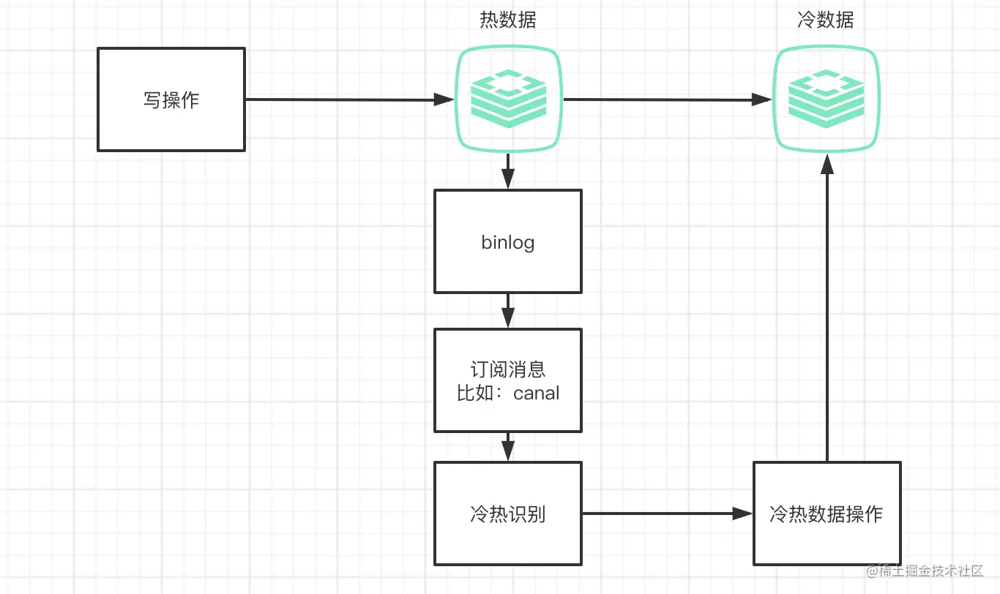
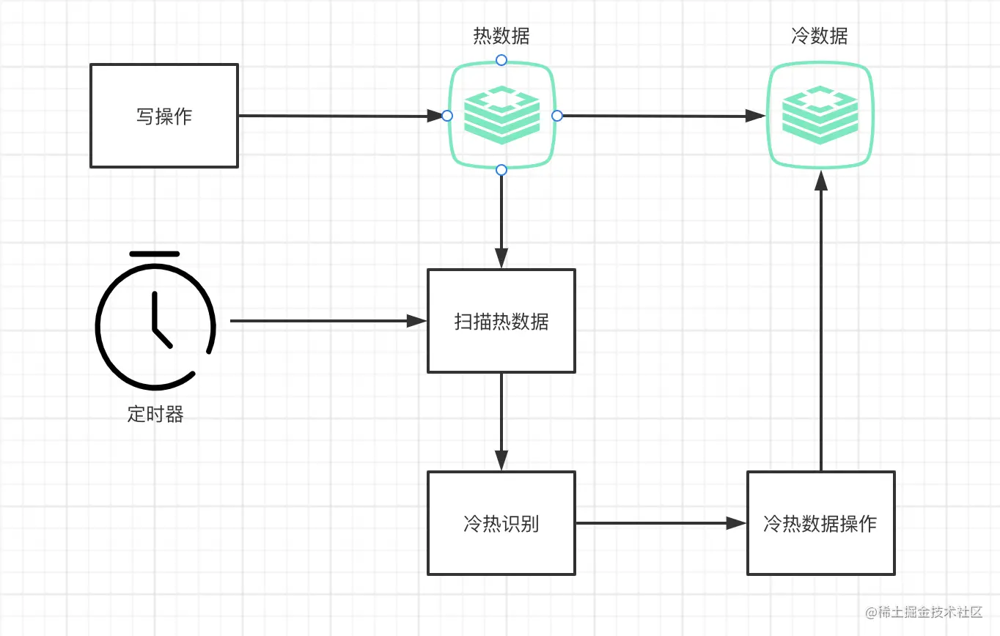

 #  冷热分离
冷热分离是分成两个库，一个是冷库一个是热库，历史上不常用的数据放到冷库中，最新的数据比较新的数据放到热库中。
这里其实就和JVM里面的新生代和老年代是类似的，有些数据经常用的，最终会放到老年代，
不经常用的数据会在新生代GC的时候就会销毁，没GC的时候会存在新生代中。

 ## 目的
 冷热分离的目的是提升MySQL数据库的查询性能，设想用户历史数据始终在同一个库，随着时间
 库中历史数据越来越大，查询速度变慢，因此历史不常用的数据分离出来，搬到冷库中，通过
 减少热库的历史数据提升热库数据查询速度。

 ## 实现方式
 
 ### 第一种实现方式

 ### 第二种实现方式

